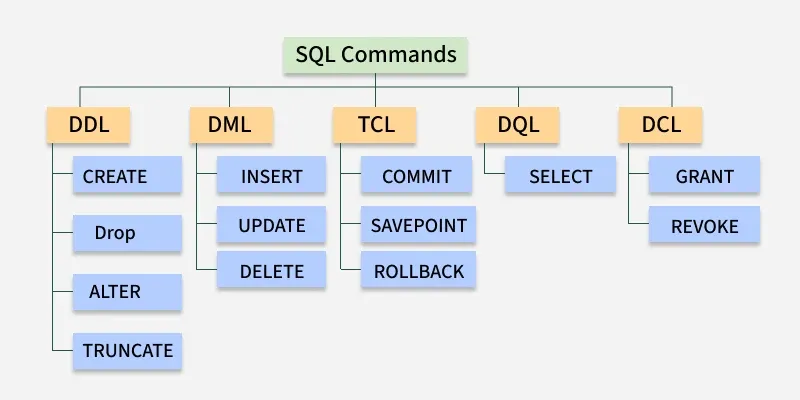

## 1. DDL - Data Definition Language
DDL (Data Definition Language) consists of SQL commands that can be used for defining, altering and deleting database structures such as tables, indexes and schemas. It simply deals with descriptions of the database schema and is used to create and modify the structure of database objects in the database
- Example:
```sql
CREATE TABLE employees (
    employee_id INT PRIMARY KEY,
    first_name VARCHAR(50),
    last_name VARCHAR(50),
    hire_date DATE
);
```
## 2. DQL - Data Query Language
DQL is used to fetch data from the database. The main command is SELECT, which retrieves records based on the query. The output is returned as a result set (a temporary table) that can be viewed or used in applications.
- Example:
```sql
SELECT first_name, last_name, hire_date
FROM employees
WHERE department = 'Sales'
ORDER BY hire_date DESC;

```
## 3. DML - Data Manipulation Language
DML commands are used to manipulate the data stored in database tables. With DML, you can insert new records, update existing ones, delete unwanted data or retrieve information.
- INSERT
- UPDATE 
- DELETE
## 4. DCL - Data Control Language
DCL (Data Control Language) includes commands such as GRANT and REVOKE which mainly deal with the rights, permissions and other controls of the database system. These commands are used to control access to data in the database by granting or revoking permissions.
## 5. TCL - Transaction Control Language
Transactions group a set of tasks into a single execution unit. Each transaction begins with a specific task and ends when all the tasks in the group are successfully completed. If any of the tasks fail, transaction fails. Therefore, a transaction has only two results: success or failure.